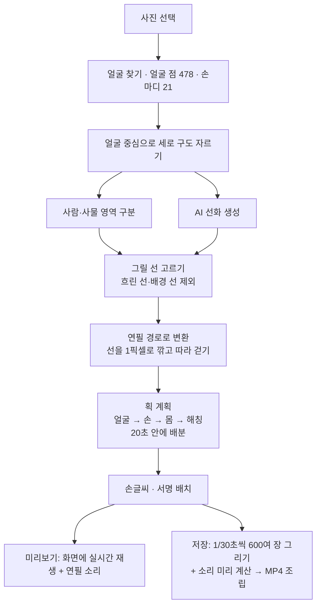

# ✏️ 팬심 한 자루 — 연필 초상화 영상 제작기

> 사진 한 장을 넣으면, 이젤 위 캔버스에 **실제 사람 손이 연필로 한 획씩 초상화를 그려 나가는 세로 쇼츠 영상**을 만들어 주는 웹 프로그램입니다.

| 항목 | 내용 |
|---|---|
| 사이트 주소 | https://leegyoungsoo1.github.io/pencil-sketch/ |
| 소스 저장소 | https://github.com/leegyoungsoo1/pencil-sketch |
| 사용하는 채널 | 유튜브 **팬심 한 자루** — https://www.youtube.com/channel/UCwYt16w5NEVyELZ-4W2xsyA |
| 설치 | 필요 없음 (크롬 브라우저로 접속, 휴대폰 홈 화면에 추가 가능) |
| 비용 | 무료 (서버·유료 API 없음, 모든 계산은 내 기기에서) |

---

## 목차

1. [어떤 프로그램인가](#1-어떤-프로그램인가)
2. [사용법](#2-사용법)
3. [어떻게 만들어졌나](#3-어떻게-만들어졌나)
4. [개발 과정](#4-개발-과정)
5. [배포와 운영](#5-배포와-운영)
6. [주의사항과 알려진 한계](#6-주의사항과-알려진-한계)
7. [부록](#7-부록)

---

## 1. 어떤 프로그램인가

### 1-1. 한 줄 요약

트로트 가수 팬아트 쇼츠 채널 **"팬심 한 자루"** 의 영상을 휴대폰 하나로 빠르게 만들기 위해 만든 도구입니다. 사진을 고르고, 제목과 손글씨 문구를 넣고, 저장 버튼을 누르면 20초짜리 연필 초상화 영상(MP4)이 만들어집니다. 목소리와 배경음악은 편집 앱에서 따로 입힌 뒤 업로드합니다.

### 1-2. 만들어지는 영상의 흐름 (기본 20초 기준)

| 순서 | 장면 | 설명 |
|---|---|---|
| 1 | **원본 사진 등장** | 기울어진 폴라로이드 사진이 테이프로 캔버스에 붙어 있다가 들리며 사라집니다 (약 1.7초) |
| 2 | **연필 스케치** | 실제 손이 연필을 쥐고 **얼굴부터** 한 획씩 그립니다. 이어서 손, 몸, 옷 순서로 그리고 그림자 빗금(해칭)을 넣습니다. "쓱쓱" 연필 소리가 획마다 납니다 |
| 3 | **손글씨 한 줄** | 그림에서 가장 빈 곳(얼굴·손은 피해서)에 "오늘도 건강하세요" 같은 문구를 연필로 씁니다 |
| 4 | **서명** | 왼쪽 위에 흘림체 서명 "Yoonseul Lee"를 쓰고, 마지막에 점을 **"탁"** 찍습니다 |
| 5 | **마무리** | 손이 화면 밖으로 빠지고 완성된 그림이 남습니다 |

화면 위쪽에는 쇼츠 자막 스타일의 **영상 제목**(최대 2줄)이 처음부터 끝까지 보입니다.

### 1-3. 결과물 사양

| 항목 | 값 |
|---|---|
| 화면 | 세로 9:16, 1080×1920 |
| 프레임 | 초당 30장 |
| 길이 | 4~20초 (기본 20초) |
| 형식 | MP4 (H.264 영상 + AAC 소리) 또는 WebM |
| 소리 | 연필 사각거리는 소리 (크기 조절 가능, 끌 수 있음) |
| 파일 이름 | `pencil-sketch-날짜-시간.mp4` |

### 1-4. 주요 기능 한눈에

- **AI 정밀 선화**: 공개 AI 모델이 사진을 화가풍 선 그림으로 바꾸고, 연필이 지나간 자리에만 그 선이 드러납니다.
- **얼굴·손 정밀 묘사**: 얼굴 점 478개, 손마디 21개를 인식해 이목구비와 손 모양을 원본과 가깝게 그립니다.
- **실제 손으로 그리기**: 촬영한 실제 팔·손 사진이 연필 끝을 따라 움직입니다 (옵션).
- **폴라로이드 스케치**: 스케치 자체를 폴라로이드 사진 칸 안에 그리고, 손글씨·서명은 아래 흰 여백에 씁니다 (옵션).
- **팬심 문구 추천**: 임영웅·이찬원·영탁 팬심 제목과 손글씨를 자동으로 채워 주고, 한 번 영상에 쓴 문구는 다시 추천하지 않습니다.
- **서명 직접 입력**: 영문은 흘림체, 한글은 붓글씨체로 서명합니다.
- **말하는 그림**: 손글씨를 쓰는 동안 그림의 입이 움직이고 눈을 깜빡입니다 (옵션, 기본 꺼짐).
- **휴대폰 최적화**: 홈 화면 아이콘, 큰 버튼, 저장 진행률 표시, 화면 꺼짐 방지.

---

## 2. 사용법

### 2-1. 처음 한 번: 휴대폰 홈 화면에 추가하기 (갤럭시 기준)

1. 크롬에서 https://leegyoungsoo1.github.io/pencil-sketch/ 를 엽니다.
2. 오른쪽 위 **⋮ → "홈 화면에 추가"** (또는 "앱 설치")를 누릅니다.
3. 홈 화면에 연필 하트 아이콘의 **"팬심 한 자루"** 가 생깁니다. 누르면 앱처럼 전체 화면으로 열립니다.

> 아이콘이나 화면이 예전 모습이면: 크롬 **설정 → 사이트 설정 → 모든 사이트 → leegyoungsoo1.github.io → 데이터 삭제** 후 다시 추가합니다.
> ⚠️ 이때 "영상에 쓴 문구" 기록도 함께 지워집니다.

### 2-2. 영상 만들기 (화면 순서대로)

**① 사진**
- **"사진 선택하기"** 를 눌러 사진을 고릅니다.
- 곧바로 "이미지 분석중..." 이 뜨고, 미리보기 위에 진행 단계와 경과 시간이 나옵니다.
  - 처음 한 번은 AI 모델을 내려받느라 시간이 더 걸립니다 (휴대폰에서 최대 1분 안팎).
  - 두 번째부터는 빨라집니다.

**② 문구**
- **팬심 문구 추천**: 가수(임영웅 / 이찬원 / 영탁 / 가수 이름 없이)를 고릅니다.
  - "사진 올리면 제목·손글씨 자동 추천" 이 켜져 있으면 사진을 고를 때 제목과 손글씨가 자동으로 채워집니다.
  - 마음에 안 들면 **🔀 다른 추천** 을 누릅니다.
  - 직접 고쳐 쓴 문구는 자동 추천이 덮어쓰지 않습니다.
- **영상 제목**: 최대 2줄, Enter로 줄바꿈합니다. 영상 맨 위에 자막처럼 보입니다.
- **손글씨 한 줄**: 그림 완성 후 빈 곳에 연필로 씁니다 (24자까지, 짧을수록 잘 보임).
- **서명**: 기본값 `Yoonseul Lee.` 입니다. 끝에 마침표(.)를 넣으면 마지막에 "탁" 점을 찍습니다.

**③ 미리보기**
- 아래 **▷ 미리보기** 로 영상을 소리와 함께 미리 봅니다 (다시 누르면 정지).
- 주황 점선 원이 AI가 찾은 얼굴 위치입니다. **틀렸다면 캔버스에서 얼굴을 톡 누르면** 그 위치로 다시 분석합니다 (PC는 드래그로 영역 지정도 가능).

**④ 세부 설정** (접혀 있음, 필요할 때만)
- 아래 [2-3. 세부 설정](#2-3-세부-설정) 표를 참고하세요.

**저장**
- **↓ MP4 영상 저장** 을 누르면 버튼이 진행률만큼 채워지며 영상을 만듭니다. 휴대폰에서 대략 20~40초 걸립니다.
- 완료되면 휴대폰의 **다운로드 폴더(내 파일 → 다운로드)** 에 저장됩니다.
- 저장하는 동안 화면이 꺼지지 않게 앱이 자동으로 막아 줍니다.

### 2-3. 세부 설정

| 묶음 | 설정 | 기본값 | 설명 |
|---|---|---|---|
| 영상 | 영상 길이 | 20초 | 4~20초. 슬라이더 또는 숫자 직접 입력 |
| 영상 | 저장 형식 | MP4 | MP4(대부분의 편집 앱) / WebM |
| 그림 | 그림 스타일 | 정밀 선화 (AI) | AI 선화 / 선만(크로키) / 선 + 그림자 살짝 |
| 그림 | 선 진하기 | 100% | 50~200%. 높이면 선이 굵고 진해짐 |
| 그림 | 그림자 해칭 양 | 40% | 0~100%. 빗금 그림자의 양 ("선만" 스타일에서는 꺼짐) |
| 그림 | 폴라로이드 사진처럼 스케치하기 | 꺼짐 | 사진 칸 안에 스케치, 손글씨·서명은 아래 흰 여백에 |
| 그림 | 연필 대신 실제 손으로 그리기 | 켜짐 | 끄면 연필만 떠서 움직임 |
| 연출 | 시작할 때 원본 사진 보여주기 | 켜짐 | 폴라로이드 원본 사진 장면 |
| 연출 | 마지막에 서명 넣기 | 켜짐 | |
| 연출 | 그림이 손글씨 문장을 말하기 | 꺼짐 | 입이 움직임. 팬 문구 영상에는 **끄는 것을 권장** |
| 소리 | 연필 사각거리는 소리 넣기 | 켜짐 | |
| 소리 | 연필 소리 크기 | 20% | 목소리·배경음악을 입힐 것을 고려해 작게 설정 |

모든 숫자 칸은 범위를 벗어난 값을 넣으면 가장 가까운 허용값으로 자동 조정됩니다.

### 2-4. 팬심 문구 추천과 "사용한 문구" 기록

- 문구는 `phrases.js` 파일에 있습니다. 가수별 제목 28~36개, 손글씨 24~32개, 공통 제목 14개·손글씨 20개로 모두 244개입니다.
- 모든 문구는 **팬이 가수와 다른 팬에게 전하는 말**로 썼습니다. 가수가 한 말처럼 지어낸 문구는 없습니다.
- 영상을 **저장하는 순간** 그 영상의 제목·손글씨가 "사용한 문구"로 기록되어 **다음부터 추천되지 않습니다** (채널 중복 업로드 방지).
- 추천 칸 아래에 `남은 추천: 제목 ○개 · 손글씨 ○개` 가 표시됩니다. 다 쓰면 안내 문구가 뜨고, **사용 기록 초기화** 로 되돌릴 수 있습니다 (확인 한 번 더 받음).
- 기록은 **그 기기 안에만** 저장됩니다. 휴대폰과 PC를 번갈아 쓰면 따로 관리됩니다.

### 2-5. 저장 후: 쇼츠로 올리기까지

1. 다운로드 폴더의 MP4를 편집 앱(예: CapCut, 블로 등)에서 불러옵니다.
2. 60대 여성 목소리 내레이션과 배경음악을 입힙니다. 앱의 연필 소리는 작게 들어가 있어 겹쳐도 괜찮습니다.
3. 유튜브에 쇼츠로 업로드합니다. 설명란에는 **"비공식 팬아트"** 문구를 넣습니다. 주의할 점은 [6-1. 저작권과 오해 방지](#6-1-저작권과-오해-방지), 설명·해시태그 문구는 [7-2. 채널 운영 자료 위치](#7-2-채널-운영-자료-위치)를 참고하세요.

### 2-6. 좋은 그림을 위한 사진 고르는 법

| 좋은 사진 | 피할 사진 |
|---|---|
| 얼굴이 크고 선명한 사진 | 얼굴이 아주 작은 단체 사진 |
| 정면 또는 약간 비스듬한 얼굴 | 뒤통수·완전한 옆모습 (옆모습도 되지만 이목구비 인식이 약함) |
| 밝고 고른 조명 | 아주 어두운 사진, 역광 |
| 무늬가 적은 옷 | 아주 어두운 옷(빗금이 빽빽해짐), 반짝이 옷(무늬가 복잡해짐) |
| 사진 원본 파일 | 영상 캡처 화면(될 수는 있지만 해상도·선명도가 낮음) |

어두운 옷에서 빗금이 너무 많으면 **그림자 해칭 양** 을 낮추세요.

### 2-7. 자주 묻는 질문

| 질문 | 답 |
|---|---|
| 얼굴 위치가 틀려요 | 미리보기 캔버스에서 얼굴을 톡 누르세요 |
| 화면이 예전 모습이에요 | 새로고침. 계속되면 크롬 사이트 데이터 삭제 (문구 사용 기록도 지워짐) |
| 인터넷 없이 되나요? | 안 됩니다. 사이트·AI 모델·글꼴을 인터넷에서 받아옵니다 |
| 사진이 인터넷으로 올라가나요? | 아니요. 모든 분석과 영상 제작은 내 휴대폰 안에서 이루어집니다 |
| 저장이 오래 걸려요 | 1080×1920 영상을 600장 넘게 한 장씩 만들기 때문입니다. 저장 중에는 앱을 띄워 두세요 |
| 편집 앱에서 영상 길이가 이상해요 | 예전 버전의 문제(20초가 3초로 인식)였고 해결되었습니다. 최신 화면인지 새로고침으로 확인하세요 |

---

## 3. 어떻게 만들어졌나

### 3-1. 기술 한눈에

| 항목 | 선택 | 이유 |
|---|---|---|
| 형태 | **웹 페이지 한 장** (HTML + CSS + 순수 JavaScript) | 설치 없이 휴대폰·PC 어디서나 실행 |
| 서버 | **없음** | 비용 0원, 사진이 외부로 나가지 않음 |
| 호스팅 | **GitHub Pages** | 무료, 코드를 올리면 1~2분 뒤 자동 반영 |
| AI | **브라우저 안에서 실행하는 공개 AI 모델 6개** | 유료 API 없이 기기에서 직접 계산 |
| 그림 | Canvas 2D | 연필 선을 한 획씩 직접 그림 |
| 소리 | Web Audio API | 연필 소리를 코드로 합성 |
| 영상 | WebCodecs + MP4/WebM 조립 라이브러리 | 한 장씩 만들어 정확한 길이의 영상 파일 생성 |
| 개발 | Claude Code (AI 코딩 도구)와 대화하며 개발 | |

### 3-2. 파일 구성

```
pencil-sketch/
├─ index.html              화면 구조 (사진·문구·미리보기·세부 설정·저장 버튼)
├─ style.css               디자인 (밝은 종이 톤, 휴대폰 우선 레이아웃)
├─ app.js                  핵심 프로그램 전체 (약 2,500줄)
├─ phrases.js              팬심 제목·손글씨 문구 목록 (244개)
├─ manifest.webmanifest    홈 화면 앱 설정 (이름·아이콘·색)
├─ assets/
│   └─ hand-right.webp     실제 오른손·팔 사진 (배경 제거, 흑연 심 보정)
└─ icons/                  앱 아이콘 (192·512·원형용 512·아이폰 180·탭 32)
```

`app.js` 안의 주요 구역:

| 구역 | 하는 일 |
|---|---|
| 작업실 장면 | 나무 벽·바닥·이젤·캔버스 보드 그리기 |
| 사진 분석 | 얼굴·사람·사물·얼굴 점·손마디 인식, 구도 자르기 |
| AI 선화 | 사진을 선 그림으로 변환하고 연필 경로로 추출 |
| 크로키 엔진 | AI 없이 사진 명암에서 선을 뽑는 방식 (선만 / 그림자 스타일) |
| 획 계획 | 어떤 선을 어떤 순서로 몇 초에 그릴지 결정 |
| 렌더링 | 흑연 질감으로 선 그리기, 손·연필·그림자, 제목, 폴라로이드 |
| 손글씨·서명 | 글꼴 글자를 연필 경로로 바꾸고 빈 곳에 배치 |
| 말하는 그림 | 입 모양 변형, 눈 깜빡임 |
| 연필 소리 | 소리 합성과 획에 맞춘 재생 |
| 영상 저장 | 프레임 생성·인코딩·파일 조립·다운로드 |
| 화면 제어 | 버튼·설정·문구 추천·사용 기록 |

### 3-3. 처리 흐름



### 3-4. 사용한 공개 AI 모델

모두 무료로 공개된 모델이며, 인터넷에서 **모델 파일만 받아와 내 기기에서 계산**합니다.

| 모델 | 만든 곳 | 하는 일 | 라이선스 |
|---|---|---|---|
| BlazeFace (face detector) | Google MediaPipe | 얼굴 위치 찾기 | Apache 2.0 |
| Face Landmarker | Google MediaPipe | 얼굴 점 478개 (눈썹·눈·눈동자·코·입술·윤곽) | Apache 2.0 |
| Hand Landmarker | Google MediaPipe | 손마디 21개 × 최대 2손 | Apache 2.0 |
| Selfie Segmenter | Google MediaPipe | 사람 영역 구분 | Apache 2.0 |
| DeepLab v3 | Google (MediaPipe 형식) | 사람·반려동물·사물 영역 구분 | Apache 2.0 |
| Informative Drawings (line art) | Caroline Chan 연구 공개 모델, ONNX 변환본 (Hugging Face `rocca/informative-drawings-line-art-onnx`) | 사진 → 화가풍 선화 | MIT |

실행 엔진: MediaPipe Tasks Vision 1.0.1, ONNX Runtime Web 1.20.1 (jsdelivr CDN).

### 3-5. 핵심 기술 설명

#### ① 얼굴 중심 구도
- 얼굴이 그림 높이의 약 1/3이 되도록 사진을 세로(3:4)로 자릅니다.
- 사진에 손이 보이면 손도 들어오게 넓힙니다. 단, **손과 얼굴을 함께 넣을 수 없으면 얼굴을 우선** 합니다.
- 잘라낸 사진으로 얼굴을 다시 인식해 정확도를 높입니다.

#### ② 그릴 선 고르기 (AI 선화 스타일)
- AI 선화의 선 중 **사람·사물 영역 안의 선만** 씁니다. 배경 글씨나 벽 무늬는 빼고 종이로 둡니다.
- **초점 흐린 선 제거**: 볼 앞의 흐린 손가락 같은 선을 뺍니다.
  - 기준은 사진마다 얼굴 선의 평균 선명도에 맞춰 자동 조절됩니다. 그래서 뮤직비디오 캡처처럼 전체가 부드러운 사진에서도 중요한 선이 살아남습니다.
  - 옆얼굴 실루엣(코·입·턱 윤곽)은 항상 보호합니다.
- 반짝이·니트 같은 복잡한 옷 무늬는 굵은 선만 남깁니다. 머리카락은 예외로 촘촘하게 남깁니다.
- 선 그림을 **1픽셀 두께로 깎고(Zhang–Suen 세선화)** 그 중심선을 따라 걸어 연필 경로를 만듭니다.

#### ③ 획 계획
- 영상 길이 안에서 "연필이 1초에 이동할 수 있는 거리"(기준 4,600px)로 시간 예산을 정합니다.
- **얼굴 → 손 → 몸 → 그림자 빗금** 순서로 예산을 나눕니다. 얼굴이 먼저 완성되어 시청자가 누구인지 빨리 알아볼 수 있습니다.
- 가까운 선끼리 이어 그리도록 순서를 정리합니다. 선 종류마다 속도와 손 드는 시간이 다릅니다.
- AI 스타일은 선을 빠뜨리지 않도록, 필요하면 손을 최대 3배 빠르게 움직입니다.

#### ④ 연필처럼 그리기
- **흑연 질감 무늬**와 종이 결 위에 선을 그리고, **필압**(시작은 살짝, 끝은 튕기듯)과 미세한 **손떨림**을 넣습니다.
- 한 번 더 옅은 선을 겹쳐 기계적인 느낌을 없앱니다.
- AI 스타일은 연필이 지나간 경로를 따라 **AI 선화를 드러내는 방식**이라, 연필 동작과 AI 그림의 디테일이 함께 살아납니다.
- "선 진하기" 100%를 넘기면 선이 더 진해지고 굵어집니다.

#### ⑤ 연필 소리
- 분홍색 잡음(pink noise)을 종이 결처럼 거칠게 가공해, 획마다 "쓱" 소리를 냅니다.
- 짧은 획은 묶어서 한 번의 "쓱"으로, 방향이 바뀌면 소리 톤을 살짝 바꿉니다. 서명 마지막 점에는 짧은 "탁" 소리가 납니다.
- 미리보기는 실시간으로, 저장할 때는 **소리를 미리 계산(오프라인 렌더)** 해서 영상과 정확히 맞춥니다.

#### ⑥ 손글씨와 서명
- 손글씨는 나눔손글씨 펜, 서명은 영문 Allura / 한글 나눔손글씨 붓 글꼴로 글자를 크게 그립니다. 그 글자를 1픽셀로 깎아 **사람이 쓰는 순서대로** 연필 경로를 만듭니다.
- 이응(ㅇ)처럼 닫힌 동그라미도 사라지지 않게 처리합니다.
- 손글씨는 그림 선이 가장 적은 곳에 배치하고, 얼굴·손은 피합니다. 공간이 좁으면 글자를 줄입니다.
- 기본 서명 `David Lee.` 만은 손으로 다듬은 모양 데이터를 쓰고, 다른 이름은 글꼴로 만듭니다.

#### ⑦ 실제 손으로 그리기
- 직접 촬영한 오른손·팔 사진(갤럭시 누끼)을 사용합니다. 흑연 심을 보정하고 소매를 아래로 이어 붙였습니다.
- **흑연 심 끝을 연필 위치에 맞춰** 붙이고, 연필이 캔버스 왼쪽에 있을 때는 팔을 눕혀 사진의 잘린 팔꿈치가 화면에 보이지 않게 합니다.
- 캔버스에 부드러운 그림자가 지고, 획 사이에는 손이 살짝 들렸다 내려옵니다.

#### ⑧ 폴라로이드 스케치
- 캔버스에 기울어진 폴라로이드를 붙이고, 스케치 좌표 전체를 그 사진 칸으로 옮겨(회전·축소) 그립니다.
- 사진 칸 밖에 해당하는 선은 **처음부터 계획에서 제외** 해서, 손이 보이지 않는 곳에서 헛손질하지 않습니다.
- 손글씨·서명은 별도의 잉크 층에 그려 흰 여백에 씁니다.

#### ⑨ 말하는 그림 (옵션)
- 얼굴 점으로 입과 턱 위치를 찾아, 손글씨 음절 수만큼 **입 부분 이미지를 변형** 해 벌렸다 닫습니다. 벌어진 곳은 연필로 칠한 입속처럼 보이게 합니다.
- 중간에 한 번 눈을 종이로 덮고 감은 눈꺼풀 선을 그려 깜빡입니다.

#### ⑩ 영상 저장
- 예전에는 화면을 실시간 녹화했습니다. 그런데 휴대폰에서 **20초 영상이 편집 앱에서 3초로 인식되는 문제**가 있었습니다.
- 지금은 **WebCodecs로 1/30초마다 한 장씩 그림을 인코딩**하고, mp4-muxer / webm-muxer 라이브러리로 **길이 정보가 정확한 표준 파일**을 만듭니다.
- 휴대폰이 느리거나 잠깐 멈춰도 프레임이 빠지지 않습니다.
- 이 방식을 지원하지 않는 브라우저에서만 예전 녹화 방식으로 자동 전환합니다.

#### ⑪ 휴대폰 대응
- 저장·재생 중 화면 꺼짐 방지(Wake Lock), 메모리가 적은 폰은 AI 입력을 줄여 처리합니다.
- 홈 화면 설치(manifest, 아이콘), 48px 이상 터치 영역, 하단 고정 버튼, 제스처 영역 여백을 적용했습니다.
- 화면 디자인은 UI/UX Pro Max 스킬의 기준(Soft UI, 접근성 대비, 단계 카드, 접히는 세부 설정)과 브랜드 색(노란 연필·흑연·크림 종이)으로 만들었습니다.

### 3-6. 외부 라이브러리와 글꼴

| 종류 | 이름 | 용도 | 라이선스 |
|---|---|---|---|
| AI 엔진 | @mediapipe/tasks-vision 1.0.1 | 얼굴·손·영역 인식 | Apache 2.0 |
| AI 엔진 | onnxruntime-web 1.20.1 | AI 선화 모델 실행 | MIT |
| 영상 | mp4-muxer 5.2.2 / webm-muxer 5.1.4 | 영상 파일 조립 | MIT |
| 글꼴 | Black Han Sans | 영상 제목, 앱 제목 | OFL |
| 글꼴 | Nanum Pen Script | 손글씨 한 줄 | OFL |
| 글꼴 | Allura / Nanum Brush Script | 서명 (영문 / 한글) | OFL |
| 글꼴 | Nanum Gothic | 앱 화면 본문 | OFL |
| 아이콘 | Lucide 모양 SVG | 버튼 아이콘 | ISC |

모두 인터넷(jsdelivr, Google Fonts)에서 불러옵니다.

---

## 4. 개발 과정

### 4-1. 시작

처음에는 Codex로 만든 "사진 → 연필 스케치 영상" 프로그램이었습니다. 그림이 실제 연필로 그리는 느낌이 아니어서, Claude Code와 대화하며 **엔진부터 다시 만들었습니다**. 이후 기능을 하나씩 요청하고 확인하는 방식으로 발전했습니다.

### 4-2. 커밋 기록 (시간순)

| 날짜 | 커밋 | 내용 |
|---|---|---|
| 09-13 | 57f6bc6 | 한 획씩 그리는 연필 크로키 엔진으로 새로 작성 |
| 09-13 | 9b8c2e6 | 털 같은 채색 대신 선 위주 크로키 + 가벼운 그림자 |
| 09-13 | 858dfa9 | 얼굴·손 정교화, 선 진하기 조절, MP4/WebM 저장 |
| 09-13 | a93bdb8 | 얼굴 점·손마디 인식으로 정밀 윤곽 |
| 09-13 | 5b94b9d | "David Lee" 서명과 마지막 "탁" 점 |
| 09-13 | 1127d44 | AI 정밀 선화 스타일 추가 |
| 09-13 | 972f25f | AI 스타일에 해칭, 코 명암 |
| 09-13 | c726c41 | 기본값 조정 (진하기 100%, 해칭 40%, 소리 20%) |
| 09-13 | 9267a36 | 따뜻한 나무 작업실의 이젤 장면, 9:16 세로 |
| 09-13 | 1211d5d | 쇼츠 제목, 폴라로이드 인트로, 손글씨 한 줄, 잡선 정리 |
| 09-13 | a76c5a2 | 손글씨를 쓰는 동안 그림이 말하기 |
| 09-13 | 7fd25c2 | 휴대폰 화면 대응 |
| 09-14 | fdc41e1 | 영상을 한 장씩 만드는 방식으로 변경 (3초 문제 해결), 입력 배치 개선 |
| 09-14 | c4c4604 | 사진 선택 즉시 "이미지 분석중..." 표시 |
| 09-14 | 0645f17 | 손글씨의 이응(ㅇ)이 사라지던 문제 수정 |
| 09-14 | f6d5a80 | 떠 있는 연필 대신 실제 손·팔로 그리기 |
| 09-14 | ae5294a | 폴라로이드 스케치, 서명 직접 입력, 숫자 입력칸 |
| 09-14 | cec80c3 | 트로트 가수 팬심 문구 추천 |
| 09-14 | 0820fcc | 이름을 "팬심 한 자루"로 변경, 홈 화면 아이콘 |
| 09-14 | 144045c | 밝은 종이 톤으로 화면 디자인 리뉴얼 |
| 09-14 | 1cb846b | 부드러운 사진의 얼굴 선 보존, 얼굴 잘림 방지 |
| 09-14 | e4f5f9a | 기본 서명을 "Yoonseul Lee."로 변경 |
| 09-14 | f5ed695 | 영상에 쓴 문구는 다시 추천하지 않기 |

### 4-3. 주요 문제와 해결

| 증상 | 원인 | 해결 |
|---|---|---|
| 20초 안에 얼굴도 다 못 그리고 끝남 | 시간 배분 없이 선을 순서대로 그림 | 얼굴 우선 시간 예산 배분 |
| 그림이 "털복숭이" 같음 | 명암을 짧은 선으로 채움 | 윤곽선 위주 크로키로 전환, 그림자는 빗금만 |
| 사진과 닮지 않음 | 얼굴·손 세부 인식 없음 | 얼굴 점 478개·손마디 21개 인식, AI 선화 도입 |
| 휴대폰에서 20초 영상이 편집 앱에서 3초 | 실시간 녹화 파일의 길이 정보 불완전, 휴대폰 녹화 끊김 | 프레임 단위 인코딩(WebCodecs) + 표준 MP4 조립 |
| 손글씨의 이응(ㅇ)이 사라짐 | 선 단순화 과정에서 닫힌 동그라미가 점으로 줄어듦 | 닫힌 곡선을 반으로 나눠 단순화 |
| 뮤직비디오 캡처 사진의 그림 품질 저하 | 사진 전체가 부드러워 중요한 선을 "흐린 선"으로 오판 | 사진별 선명도에 맞춘 기준 + 실루엣 보호 |
| 멀리 있는 손 때문에 얼굴이 잘림 | 손과 얼굴의 가운데로 구도를 잡음 | 둘 다 못 넣으면 얼굴 우선 |
| 실제 손 사진의 팔이 잘려 보임 | 촬영 사진이 팔꿈치에서 잘림 | 팔 기울기로 잘린 부분을 화면 밖에 두고, 소매만 이어 붙임 |
| GitHub 저장소를 비공개→공개로 바꾸자 사이트 접속 불가 | 비공개 전환 시 Pages가 꺼짐 | Pages를 main 브랜치로 다시 켬 |

---

## 5. 배포와 운영

### 5-1. 수정 사항이 사이트에 반영되는 흐름

```
코드 수정 → git commit → git push (main 브랜치)
        → GitHub Pages가 자동으로 사이트 갱신 (보통 1~2분)
        → 휴대폰에서 새로고침
```

### 5-2. 저장소 설정

- 저장소: `leegyoungsoo1/pencil-sketch` (공개)
- GitHub Pages: **main 브랜치, 최상위 폴더(/)**
- ⚠️ 저장소를 **비공개로 바꾸면 Pages가 꺼집니다.** 다시 공개로 돌린 뒤 **Settings → Pages** 에서 Branch를 `main`, 폴더를 `/ (root)` 로 선택하고 Save를 눌러야 합니다.
- 저장소가 공개이므로 `assets/hand-right.webp`(실제 팔 사진)도 공개되어 있습니다 (공개에 동의함).

### 5-3. 문구 추가·수정하기

`phrases.js` 파일에서 가수별 `titles`(제목)와 `lines`(손글씨) 목록을 고치면 됩니다.

```js
임영웅: {
  titles: [
    '임영웅 연필 초상화\n팬심으로 그렸어요',   // 제목은 \n 으로 두 줄
    ...
  ],
  lines: [
    '건강하고 행복하세요',                     // 손글씨는 15자 이내 권장
    ...
  ],
},
```

- 공통 문구의 `{name}` 은 선택한 가수 이름으로 바뀝니다.
- 새 가수를 추가하려면 `phrases.js` 에 항목을 만들고, `index.html` 의 가수 선택 목록(`#singer`)에도 같은 이름을 추가합니다.
- 문구는 가수가 한 말이 아니라 **팬이 전하는 말투**로 쓰는 원칙을 지켜 주세요.

---

## 6. 주의사항과 알려진 한계

### 6-1. 저작권과 오해 방지

- **사진 저작권**: 기사·공연·뮤직비디오 사진은 대부분 사진가나 소속사의 저작물입니다. 수익 창출 채널은 신고받을 수 있으니, 가능하면 직접 찍었거나 사용이 허락된 사진을 쓰세요.
- **가수의 말처럼 보이지 않게**: 추천 문구는 팬의 말입니다. "그림이 말하기(입 움직임)" 옵션을 켜면 가수가 직접 말하는 것처럼 보일 수 있어 기본으로 꺼 두었습니다.
- **비공식 표시**: 영상 설명과 채널 설명에 "비공식 팬아트" 임을 적습니다.
- **채널 이름**에는 가수 이름을 넣지 않았습니다 (공식 채널 오해 방지).

### 6-2. 알려진 한계

| 한계 | 내용 / 대처 |
|---|---|
| 인터넷 필요 | 사이트·AI 모델·글꼴을 인터넷에서 받아옵니다. 오프라인 사용은 아직 불가 (설치형 앱(PWA 오프라인) 전환으로 가능) |
| 문구 사용 기록은 기기별 | 휴대폰·PC 기록이 따로 관리되고, 사이트 데이터 삭제 시 함께 지워짐 |
| 어두운 옷의 빗금 | 어두운 옷 전체가 빗금으로 빽빽해질 수 있음 → "그림자 해칭 양" 낮추기 |
| 옆얼굴 | 얼굴 점 478개 인식이 실패할 수 있어 이목구비 세밀 묘사가 약해짐 |
| 아주 짧은 영상 (4~6초) | 손글씨·서명 시간이 차지하는 비중이 커서 그림 그리는 시간이 매우 짧음 → 15~20초 권장 |
| 초점이 흐린 손 | 의도적으로 그림에서 뺌 |
| 처음 실행 | AI 모델을 내려받느라 느림 (두 번째부터 빨라짐) |

---

## 7. 부록

### 7-1. PC에서 직접 실행해 보기

```bash
# 프로젝트 폴더에서 간단한 로컬 서버 실행 (Python 3 필요)
python -m http.server 8000
# 브라우저에서 http://localhost:8000 열기
```

크롬 최신 버전을 권장합니다 (WebCodecs 영상 저장 지원).

### 7-2. 채널 운영 자료 위치

| 자료 | 위치 |
|---|---|
| 채널 프로필·배너·워터마크 이미지 | 바탕화면 `팬심한자루 채널` 폴더 |
| 채널 설명·키워드·영상 설명·해시태그·고정 댓글 문구 | 같은 폴더의 `채널 문구 모음.txt` |
| 앱 아이콘 원본 | `icons/` 폴더 |

### 7-3. 브랜드 정리

| 항목 | 값 |
|---|---|
| 이름 | 팬심 한 자루 |
| 한 줄 소개 | 연필 한 자루에 팬심을 담아, 사진 속 얼굴을 한 획씩 그리는 영상 |
| 서명 | Yoonseul Lee. |
| 목소리 | 60대 여성 내레이션 |
| 색 | 노란 연필 `#F5B700` · 흑연 `#2D2A27` · 크림 종이 `#F6F0E3` |
| 제목 글꼴 | Black Han Sans |
| 로고 | 연필로 그린 하트 + 노란 연필 |
